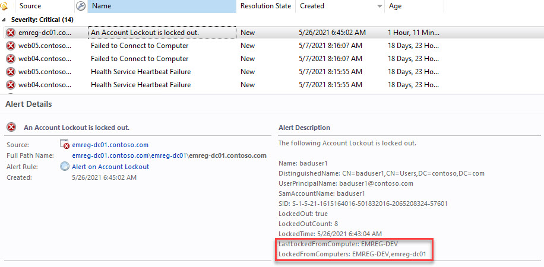

# Monitor Account Lockouts
Monitoring Account Lockouts using scom can be tricky. The default Event Log Data Source of SCOM cannot perform well especially on security logs on Domain Controllers. 

The management pack can be [downloaded here](https://github.com/emrgcl/MonitorAccountLockouts/releases/download/1.0.0.30/SCOM.MonitorAccountLockouts_1.0.0.30.zip) and you can [click here for Installation steps](#Installation).

# Purpose of this management pack

- ***Find Out Locking Computer:*** The management pack not only finds out the LastLockingComputer but also reports all the LockingComputers for the account to support fixing all computers at one operation!.

    

- ***Performance:*** Scan the event log with the best performing way. The MP can scan 1gb / 1.5 million events in 80 seconds.

The magic here is to use Xpath query of Get-WinEvent. The following is the query used in the script.

```PowerShell
$EventLogParams = @{

'LogName' = 'Security'
'FilterXPath' = "*[System[EventID=4740] and EventData[Data[@Name='TargetUserName']='$($LockedAccount.SAmAccountName)']]"

}   

$Events = @(Get-WinEvent @EventLogPArams)
```
# Requirements
1. **ActiveDirectory** Module installed on **PDC Emulator Role**. If you need to find out PDC Emulator Role on your environment before Installing the Management Pack run the following PowerShell line on any Domain controller.
    ```PowerShell
    (Get-ADDomain -ErrorAction stop).PDCEmulator
    ```
1. Active Directory Management Pack version **10.0.2.2**. [Download](https://www.microsoft.com/en-us/download/confirmation.aspx?id=54525)
# Installation
1. Please ensure you meet the [Requirements](#Requirements)
1. [Download the management pack](https://github.com/emrgcl/MonitorAccountLockouts/releases/download/1.0.0.30/SCOM.MonitorAccountLockouts_1.0.0.30.zip) and extract the zip file.
1. There are 3 versions select the version required by your environment.
1. In Operations Manager Console click Administration.
1. Right click on Administration and select "Import Management Packs"
1. "Add/Add from disks/No" and select the mp desired from the path extracted in the first step.
1. Click Install.
